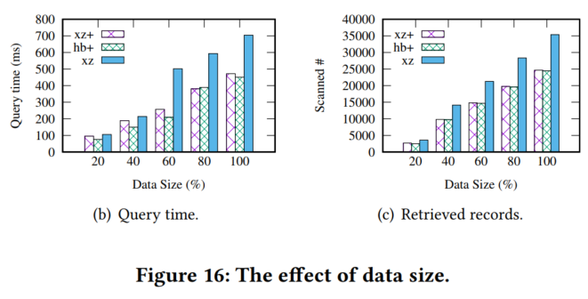

# XZPlus-Redis

### Introduction
We propose a subtle spatial index for efficiently managing non-point objects, namely XZ+, which consumes a little memory. We integrate a novel idea of position code within the indexed space of XZ-Ordering for representing non-point objects, which ensures that each object is entirely contained by the smallest and most suitable space, and spatially close objects have as many similar representatives in lexicographical order as possible.

Theoretically, its relative approximation error is reduced by 36\%-46\%  comparing with XZ-Ordering. Then, we design a bijective function from indexed spaces to a minimalist integer domain, which is more efficient to store and search objects than strings. 

Meanwhile, we designed an efficient query processing algorithm, which directly skips extracting 33\%-44\% of unnecessary objects than XZ-Ordering in theory. Furthermore, we developed an open-source toolkit on Redis (\textbf{XZ+R}) to conveniently and efficiently manage non-point objects. Our evaluations of XZ+ on two real and five synthetic datasets show that XZ+ has the best efficiency than state-of-the-art static spatial indexes. Comparing with XZ-Ordering, practically, XZ+ saves 11\% and 47\% of query time on two real datasets and reduces unnecessary retrieved objects by 29\%.

### Example
1.init client

<code> 
XZRClient(host: String, ip: Int, table: String, resolution: Int = 16)
</code>

where "127.0.0.1" is your host, 6379 is port of Redis, "xzr_table2" is the table that storing data, 16 is the maximum resolution.

2.Insert

<code> 
def insert(id: String, geom: String, value: String): Unit
</code>

3.Range Query

```
def rangeQuery(minLng: Double, minLat: Double, maxLng: Double, maxLat: Double): util.ArrayList[(String, String)]
```

4.example

Insert

```
public class InsertExample {
    public static void main(String[] args) {
        XZRClient client = new XZRClient("127.0.0.1", 6379, "xzr_table2", 16);
        double lat = 26.21497;
        double lon = 106.25618;
        Random random = new Random(1000000);
        Random randomLat = new Random(2661497);
        for (int j = 1; j <= 5; j++) {
            for (int i = 1; i <= 100; i++) {
                double offset = random.nextDouble() * 0.5;
                double offsetLat = randomLat.nextDouble() * 0.5;
                MinimumBoundingBox mbr = new MinimumBoundingBox(lon + offset, lat + offsetLat, lon + offset + j * 0.005, lat + offsetLat + j * 0.005);
                client.insert((j - 1) * 100 + i + "", mbr.toPolygon(4326).toText(), mbr.toPolygon(4326).toText());
            }
        }
        client.close();
    }
}
```

Range query

```
public class RangeQuery {
    public static void main(String[] args) {
        XZRClient client = new XZRClient("127.0.0.1", 6379, "xzr_table2", 16);
        ArrayList<Tuple2<String, String>> result = client.rangeQuery(106.24618, 26.20497, 106.86618, 26.82497);
        System.out.println(result.size());
    }
}
```

5. Experiment
Package experiment shows our evaluations. 

(1) Varying Query window


(2) Varying maximum resolutions


(3) Varying query windows for XZ+ with different resolutions


(4) The effect of data sizes



(5) The effect of position code


(6) Data Reduction 

